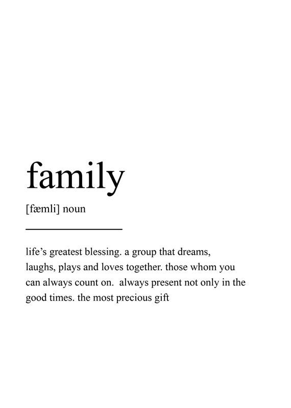

## __A collection of quotes about FAMILY__

> "Family is not an important thing. It's everything." —​ Michael J. Fox

> "The only rock I know that stays steady, the only institution I know that works, is the family." —​ Lee Iacocca

> "My life was started with the family, and I know it would end with the family too." —​ Myself (Donaldclk)

> 
—​ Captured from Pinterest

