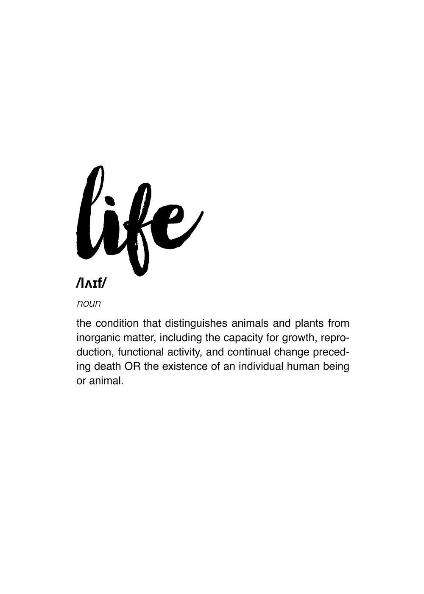

## __A collection of quotes about LIFE__

> "Life is really simple, but we insist on making it complicated." —​ Confucius

> "In the end, it's not the years in your life that count. It's the life in your years." —​ Abraham Lincoln

> "The two most important days in your life are the day you are born and the day you find out why." —​ Mark Twain

> 
—​ Captured from Pinterest

